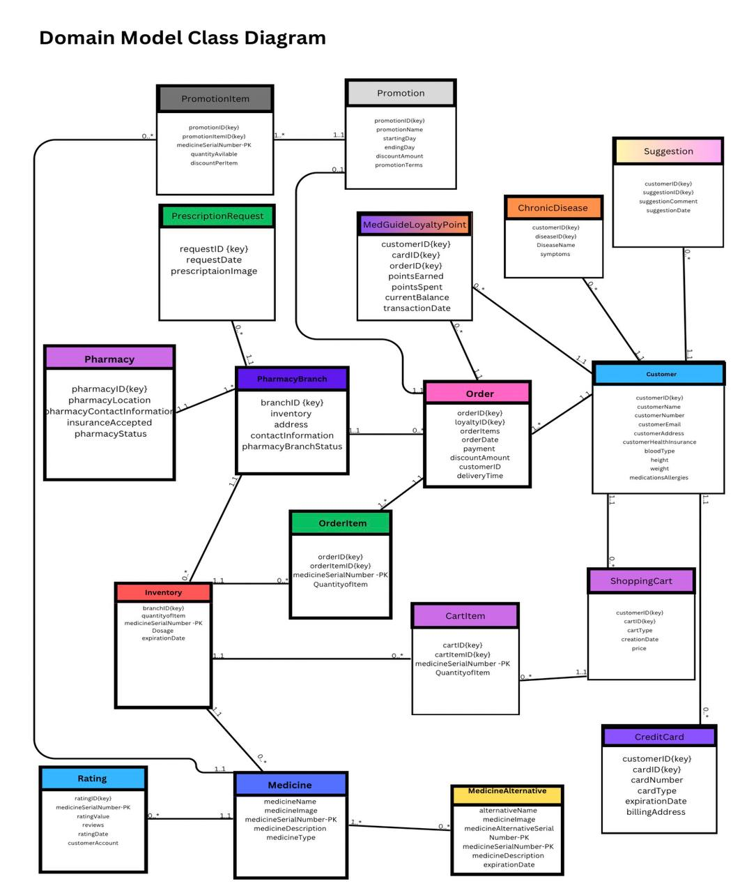
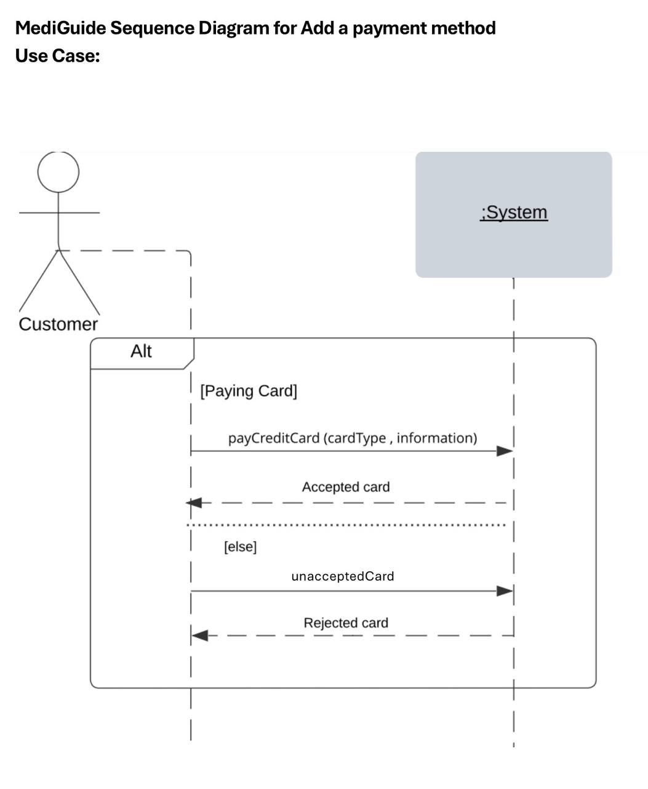

# MediGuide – System Analysis and Design

MediGuide is a proposed pharmacy platform designed to help users find nearby pharmacies that have their required medications available.

## My Contribution

- Proposed the original system idea.

- Helped guide and coordinate the team throughout the project.

- Contributed to the Business Vision and system requirements.

- Developed the Domain Model Class Diagram.

- Developed the Sequence Diagram.
  
## Domain Model Class Diagram

## Sequence Diagram – Add a Payment Method

## Key System Capabilities

- Find nearby pharmacies with the required medication.

- View alternative medications.

- Find pharmacies that accept the user's insurance.

- View medication ratings and reviews.

- Maintain user health and prescription information.

  ## Skills Demonstrated

- Systems Analysis and Design

- Requirements Analysis

- UML Modeling

- Domain Model Class Diagrams

- Sequence Diagrams

- Business Requirements

- Team Collaboration and Coordination
